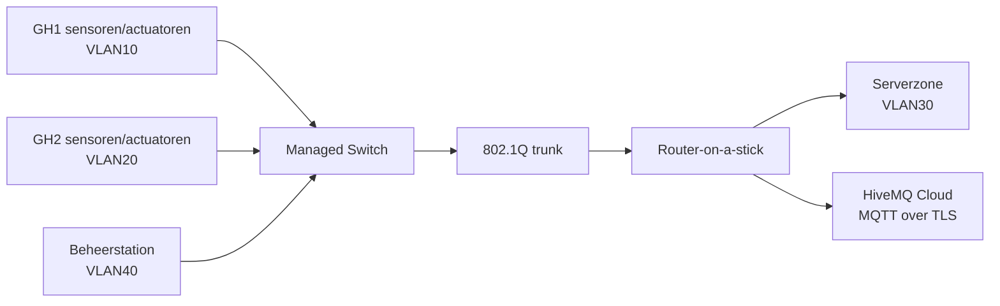

# Stap 1 – Netwerkanalyse

In deze stap heb ik uitgewerkt hoe componenten in mijn slimme kas met elkaar communiceren. Het netwerk moet continu meetdata kunnen vervoeren (temperatuur, vocht, CO₂), aansturingen betrouwbaar afleveren (ventilator, irrigatie, verlichting) en beheer op afstand mogelijk maken zonder dat de kasnetwerken direct openstaan naar alles.

## Basisfunctionaliteiten
- Betrouwbare verbinding tussen sensoren/actuatoren en centrale verwerking.
- Gescheiden datastromen per kas (GH1 en GH2).
- Centrale monitoring, logging en beheer via een beheernetwerk.
- Veilige communicatie met een MQTT-broker voor telemetrie en commando’s.

## Benodigde netwerkcomponenten
- IoT-sensoren en actuatoren per kas.
- Managed switch (VLAN-segmentatie).
- Router (inter-VLAN routing, ACL-beleid, gateway-functie).
- Logische serverzone (lokale services/PoC-validatie).
- Beheerstation in managementsegment.
- Cloud-koppeling voor MQTT-broker.

## Gebruikte protocollen
- **MQTT** voor publish/subscribe tussen sensoren, controller en actuatoren.
- **TLS** voor versleutelde MQTT-verbindingen richting cloudbroker.
- **TCP/IP** als onderliggende netwerkstack (routing, adressering, transport).

## Eenvoudig netwerkschema (concept)

Ik heb hiermee een basis gelegd waarin schaalbaarheid (extra sensoren/kassen) en security (segmentatie + versleuteling) direct zijn meegenomen.
